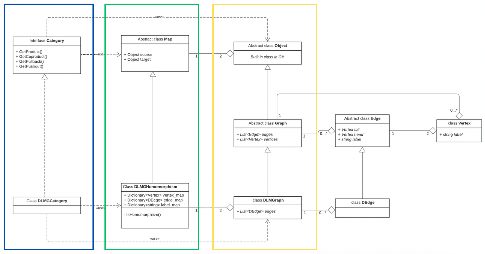

# Categories of Directed Labeled Multigraphs

This repository implements computational tools for exploring **universal constructions** in category theory, specifically within the **category of Directed Labeled Multigraphs (DLMG)**. The project calculates constructs such as **products**, **coproducts**, **pullbacks**, and **pushouts**, utilizing .NET's C# for flexible, object-oriented implementation. See Category_of_Graphs_Report.pdf for more details.

## Overview

Category theory provides an abstract framework for studying mathematical structures and their relationships. This project focuses on a concrete category, DLMG, where:
- **Objects** are directed labeled multigraphs (DLMGs).
- **Morphisms** preserve graph structure, mapping vertices, edges, and labels.

### Universal Constructions Implemented:
1. **Product**: Represents the tensor product of two graphs.
2. **Coproduct**: Represents the disjoint union of two graphs.
3. **Pullback**: A subgraph of the product satisfying certain conditions.
4. **Pushout**: A "glued" coproduct that merges graphs along a shared structure.

## Architecture

The project adheres to a layered architecture, balancing abstraction and specificity:
1. **Abstract Classes**:
    - `Graph<T>`: A generic representation of a graph.
    - `Edge`: Abstract edges; specialized by `DEdge` for directed edges.
    - `Vertex`: Represents graph vertices with unique labels.
    - `Map<T>`: Abstract representation of morphisms.

2. **Concrete Classes**:
    - `DLMGraph`: Directed labeled multigraphs.
    - `DLMGHomomorphism`: Morphisms between DLMGraphs.
    - `DLMGCategory`: Implements universal constructions for the DLMG category.

3. **Interfaces**:
    - `ICategory<T>`: Defines methods for universal constructions, such as `GetProduct`, `GetCoproduct`, `GetPullback`, and `GetPushout`.

### UML Diagram



## Key Definitions

- **Directed Labeled Multigraph (DLMG)**:
  A graph with:
    - Vertices (`V`) and edges (`E`).
    - Labels for vertices (`ΛV`) and edges (`ΛE`).
    - Functions assigning source/target vertices and labels to edges.

- **Morphisms**:
  Functions mapping:
    - Vertices to vertices.
    - Edges to edges.
    - Labels to labels, preserving graph structure.

- **Universal Constructions**:
    - **Product**: Combines graphs into a single graph containing shared and independent elements.
    - **Coproduct**: Combines graphs without overlap.
    - **Pullback**: Extracts a subgraph based on shared structure.
    - **Pushout**: Merges graphs along a shared structure.

## Installation

Follow the steps below to install and use this class library in your own projects.

### 1. Clone the Repository

First, clone the repository to your local machine:

```bash
git clone https://github.com/mzheplin/Categories.git
cd Categories
```
- **Using Visual Studio**:
    - Open Visual Studio and create a new project (e.g., Console Application).
    - Navigate to the newly created project folder.

### 3. Add the Class Library to Your Project

You can now add this class library to your project. There are two ways to do this:

#### Option 1: Add as a Project Reference

If the class library and your project are in the same solution, you can reference the class library directly:

```bash
dotnet add reference ../Categories/Categories.csproj
```

#### Option 2: Add as a DLL Reference

If you want to compile the class library separately, you can build the library and add the resulting DLL to your project.

- **Build the class library**:
  In the `Categories` directory, run:
  ```bash
  dotnet build
  ```
  This will generate a DLL in the `bin/Debug/net7.0` folder.

- **Reference the DLL in your project**:
  ```bash
  dotnet add reference /path/to/your/bin/Debug/net7.0/Categories.dll
  ```

### 4. Use the Library in Your Code

After referencing the class library, you can start using it in your code. Here’s an example of how to create a graph using the library:

```csharp
using Categories
...
```


## Examples

This section demonstrates how to use the library to create graphs, define morphisms, and compute universal constructions.

---

### 1. Creating a Directed Labeled Multigraph

You can create a directed labeled multigraph by defining its vertices and edges:

```csharp
using Categories;

Vertex v1 = new Vertex("v1");
Vertex v2 = new Vertex("v2");
Vertex v3 = new Vertex("v3");

List<DEdge> edges = new List<DEdge> {
    new DEdge(v1, v2, "a"),
    new DEdge(v2, v3, "b"),
};

DLMGraph graph = new DLMGraph(edges, new List<Vertex> { v1, v2, v3 });
Console.WriteLine(graph.ToString());
```

#### Output in DOT Format:
```css
digraph G {
0 [label="v1"];
1 [label="v2"];
2 [label="v3"];
0 -> 1 [label="a"];
1 -> 2 [label="b"];
}
```

### 2. Calculating the Coproduct of Two Graphs
The coproduct of two graphs is their disjoint union. Below is an example:

```csharp
using Categories;

Vertex v1 = new Vertex("v1");
Vertex v2 = new Vertex("v2");
List<DEdge> edges1 = new List<DEdge> {
    new DEdge(v1, v2, "a")
};

Vertex v3 = new Vertex("v3");
Vertex v4 = new Vertex("v4");
List<DEdge> edges2 = new List<DEdge> {
    new DEdge(v3, v4, "b")
};

DLMGraph g1 = new DLMGraph(edges1, new List<Vertex> { v1, v2 });
DLMGraph g2 = new DLMGraph(edges2, new List<Vertex> { v3, v4 });

DLMGCategory category = new DLMGCategory();
var coproduct = category.GetCoproduct(g1, g2);
Console.WriteLine(coproduct.ToString());
```
#### Output in DOT Format:
```css
coproduct:
digraph G {
    0 [label ="v1 - 0"];
    1 [label ="v2 - 0"];
    2 [label ="v3 - 1"];
    3 [label ="v4 - 1"];
    0 -> 1 [label="a - 0"] ;
    2 -> 3 [label="b - 1"] ;
}

Map from the first object:
Souce:
digraph G {
    0 [label ="v1"];
    1 [label ="v2"];
    0 -> 1 [label="a"] ;
}

Target:
digraph G {
    0 [label ="v1 - 0"];
    1 [label ="v2 - 0"];
    2 [label ="v3 - 1"];
    3 [label ="v4 - 1"];
    0 -> 1 [label="a - 0"] ;
    2 -> 3 [label="b - 1"] ;
}

on vertices:
v1 => v1 - 0
v2 => v2 - 0
on labeles:
a => a - 0
on edges:
a: v1 -> v2 => a - 0: v1 - 0 -> v2 - 0

Map from the second object:
Souce:
digraph G {
    0 [label ="v3"];
    1 [label ="v4"];
    0 -> 1 [label="b"] ;
}

Target:
digraph G {
    0 [label ="v1 - 0"];
    1 [label ="v2 - 0"];
    2 [label ="v3 - 1"];
    3 [label ="v4 - 1"];
    0 -> 1 [label="a - 0"] ;
    2 -> 3 [label="b - 1"] ;
}

on vertices:
v3 => v3 - 1
v4 => v4 - 1
on labeles:
b => b - 1
on edges:
b: v3 -> v4 => b - 1: v3 - 1 -> v4 - 1
```

### 3. Calculating the Product of Two Graphs
The product of two graphs is their tensor product. Below is an example:
```csharp
using Categories;

Vertex v1 = new Vertex("v1");
Vertex v2 = new Vertex("v2");
List<DEdge> edges = new List<DEdge> {
    new DEdge(v1, v2, "a")
};

DLMGraph g1 = new DLMGraph(edges, new List<Vertex> { v1, v2 });

DLMGCategory category = new DLMGCategory();
var product = category.GetProduct(g1, g1);
Console.WriteLine(product.ToString());
```

#### Output in DOT Format:
```css
product:
digraph G {
    0 [label ="v1 - v1"];
    1 [label ="v1 - v2"];
    2 [label ="v2 - v1"];
    3 [label ="v2 - v2"];
    0 -> 3 [label="a - a"] ;
}

Map to first object:
Souce:
digraph G {
    0 [label ="v1 - v1"];
    1 [label ="v1 - v2"];
    2 [label ="v2 - v1"];
    3 [label ="v2 - v2"];
    0 -> 3 [label="a - a"] ;
}

Target:
digraph G {
    0 [label ="v1"];
    1 [label ="v2"];
    0 -> 1 [label="a"] ;
}

on vertices:
v1 - v1 => v1 
v1 - v2 => v1 
 v2 - v1 => v2
v2 - v2 => v2
on labeles: 
a - a => a 
on edges: a - a: v1 - v1 -> v2 - v2 => a: v1 -> v2
Map to second object: Souce: digraph G {
0 [label ="v1 - v1"];
1 [label ="v1 - v2"];
2 [label ="v2 - v1"];
3 [label ="v2 - v2"];
0 -> 3 [label="a - a"] ;
}

Target:
digraph G {
    0 [label ="v1"];
    1 [label ="v2"];
    0 -> 1 [label="a"] ;
}

on vertices:
v1 - v1 => v1
v1 - v2 => v2
v2 - v1 => v1 
v2 - v2 => v2
on labeles:
a - a => a
on edges:
a - a: v1 - v1 -> v2 - v2 => a: v1 -> v2
```

### 4. Calculating the Pushout of Two Graphs
The pushout of two graphs glues them along a shared structure. Below is an example:
```csharp
using Categories;

Vertex a = new Vertex("a");
Vertex b = new Vertex("b");
Vertex c = new Vertex("c");
Vertex d = new Vertex("d");

List<DEdge> edges1 = new List<DEdge>() {
new DEdge(a, b, "a"),
new DEdge(b, a, "b"),};

DLMGraph g_1 = new DLMGraph(edges1);

List<DEdge> edgesc = new List<DEdge>() {
new DEdge(a, b, "a"),
new DEdge(c, b, "b"),
new DEdge(c, d, "c")};

DLMGraph g_c = new DLMGraph(edgesc);

List<DEdge> edges2 = new List<DEdge>() {
new DEdge(a, b, "a"),
new DEdge(c, b, "c"),
new DEdge(c, b, "d")};

DLMGraph g_2 = new DLMGraph(edges2);

Dictionary<Vertex, Vertex> v_c1 = new Dictionary<Vertex, Vertex>()
{ {a,a },{c,a},{b,b},{d,b }};
Dictionary<string, string> l_c1 = new Dictionary<string, string>()
{{"a","a" },{"b","a"},{"c","a"} };
Dictionary<Vertex, Vertex> v_c2 = new Dictionary<Vertex, Vertex>()
{{a,a },{c,a},{b,b},{d,b }};
Dictionary<string, string> l_c2 = new Dictionary<string, string>()
{{"a","a" },{"b","a"},{"c","a"}};
DLMGHomomorphism h1 = new DLMGHomomorphism(g_c,g_1,v_c1, l_c1);
DLMGHomomorphism h2 = new DLMGHomomorphism(g_c, g_2, v_c2, l_c2);

DLMGCategory category = new DLMGCategory();
var pushout = category.GetPushout(h1,h2); ;
System.Console.WriteLine(pushout);
```

#### Output in DOT Format:
```css
pushout:
digraph G {
    0 [label ="a"];
    1 [label ="b"];
    2 [label ="c - 1"];
    0 -> 1 [label="a"] ;
    1 -> 0 [label="b - 0"] ;
    2 -> 1 [label="c - 1"] ;
    2 -> 1 [label="d - 1"] ;
}

Map from first object:
Souce:
digraph G {
    0 [label ="a"];
    1 [label ="b"];
    0 -> 1 [label="a"] ;
    1 -> 0 [label="b"] ;
}

Target:
digraph G {
    0 [label ="a"];
    1 [label ="b"];
    2 [label ="c - 1"];
    0 -> 1 [label="a"] ;
    1 -> 0 [label="b - 0"] ;
    2 -> 1 [label="c - 1"] ;
    2 -> 1 [label="d - 1"] ;
}

on vertices:
a => a
b => b
on labeles:
a => a
b => b - 0
on edges:
a: a -> b => a: a -> b
b: b -> a => b - 0: b -> a

Map from second object:
Source:
digraph G {
0 [label ="a"];
1 [label ="c"];
2 [label ="b"];
0 -> 2 [label="a"] ;
1 -> 2 [label="c"] ;
1 -> 2 [label="d"] ;
}

Target:
digraph G {
    0 [label ="a"];
    1 [label ="b"];
    2 [label ="c - 1"];
    0 -> 1 [label="a"] ;
    1 -> 0 [label="b - 0"] ;
    2 -> 1 [label="c - 1"] ;
    2 -> 1 [label="d - 1"] ;
}

on vertices:
a => a
c => c - 1
b => b
on labeles:
a => a
c => c - 1
d => d - 1
on edges:
a: a -> b => a: a -> b
c: c -> b => c - 1: c - 1 -> b
d: c -> b => d - 1: c - 1 -> b
```

### 5. Calculating the Pullback of Two Graphs
The pullback of two graphs extracts their shared substructure. Below is an example:

```csharp
using Categories;

Vertex a = new Vertex("a");
Vertex b = new Vertex("b");
Vertex c = new Vertex("c");
Vertex d = new Vertex("d");

List<DEdge> edges1 = new List<DEdge>() {
new DEdge(b, a, "a"),
new DEdge(b, a, "b"),
};

DLMGraph g_1 = new DLMGraph(edges1);

List<DEdge> edgesc = new List<DEdge>() {
new DEdge(a, b, "a"),
new DEdge(c, b, "b"),
new DEdge(c, d, "c")
};

DLMGraph g_c = new DLMGraph(edgesc);

List<DEdge> edges2 = new List<DEdge>() {
new DEdge(a, b, "a"),
new DEdge(c, b, "c"),
new DEdge(c, b, "d")
};

DLMGraph g_2 = new DLMGraph(edges2);

Dictionary<Vertex, Vertex> v_c1 = new Dictionary<Vertex, Vertex>()
{ {a,b },{c,b},{b,a},{d,a }};
Dictionary<string, string> l_c1 = new Dictionary<string, string>()
{{"a","a" },{"b","b"},{"c","a"} };
Dictionary<Vertex, Vertex> v_21 = new Dictionary<Vertex, Vertex>()
{{a,b },{c,b},{b,a}};
Dictionary<string, string> l_21 = new Dictionary<string, string>()
{{"a","a" },{"d","b"},{"c","a"} };
DLMGHomomorphism h1 = new DLMGHomomorphism(g_c, g_1, v_c1, l_c1);
DLMGHomomorphism h2 = new DLMGHomomorphism(g_2, g_1, v_21, l_21);

DLMGCategory category = new DLMGCategory();
var pullback = category.GetPullback(h1,h2); ;
System.Console.WriteLine(pullback);
```
#### Output in DOT Format:
```css
pullback:
digraph G {
0 [label ="a - a"];
1 [label ="a - c"];
2 [label ="c - a"];
3 [label ="c - c"];
4 [label ="b - b"];
5 [label ="d - b"];
0 -> 4 [label="a - a"] ;
1 -> 4 [label="a - c"] ;
3 -> 4 [label="b - d"] ;
2 -> 5 [label="c - a"] ;
3 -> 5 [label="c - c"] ;
}

Map to first object:
Souce:
digraph G {
0 [label ="a - a"];
1 [label ="a - c"];
2 [label ="c - a"];
3 [label ="c - c"];
4 [label ="b - b"];
5 [label ="d - b"];
0 -> 4 [label="a - a"] ;
1 -> 4 [label="a - c"] ;
3 -> 4 [label="b - d"] ;
2 -> 5 [label="c - a"] ;
3 -> 5 [label="c - c"] ;
}

Target:
digraph G {
0 [label ="a"];
1 [label ="c"];
2 [label ="b"];
3 [label ="d"];
0 -> 2 [label="a"] ;
1 -> 2 [label="b"] ;
1 -> 3 [label="c"] ;
}

on vertices:
a - a => a
a - c => a
c - a => c
c - c => c
b - b => b
d - b => d
on labeles:
a - a => a
a - c => a
b - d => b
c - a => c
c - c => c
on edges:
a - a: a - a -> b - b => a: a -> b
a - c: a - c -> b - b => a: a -> b
b - d: c - c -> b - b => b: c -> b
c - a: c - a -> d - b => c: c -> d
c - c: c - c -> d - b => c: c -> d

Map to second object:
Souce:
digraph G {
0 [label ="a - a"];
1 [label ="a - c"];
2 [label ="c - a"];
3 [label ="c - c"];
4 [label ="b - b"];
5 [label ="d - b"];
0 -> 4 [label="a - a"] ;
1 -> 4 [label="a - c"] ;
3 -> 4 [label="b - d"] ;
2 -> 5 [label="c - a"] ;
3 -> 5 [label="c - c"] ;
}

Target:
digraph G {
0 [label ="a"];
1 [label ="c"];
2 [label ="b"];
0 -> 2 [label="a"] ;
1 -> 2 [label="c"] ;
1 -> 2 [label="d"] ;
}

on vertices:
a - a => a
a - c => c
c - a => a
c - c => c
b - b => b
d - b => b
on labeles:
a - a => a
a - c => c
b - d => d
c - a => a
c - c => c
on edges:
a - a: a - a -> b - b => a: a -> b
a - c: a - c -> b - b => c: c -> b
b - d: c - c -> b - b => d: c -> b
c - a: c - a -> d - b => a: a -> b
c - c: c - c -> d - b => c: c -> b
```